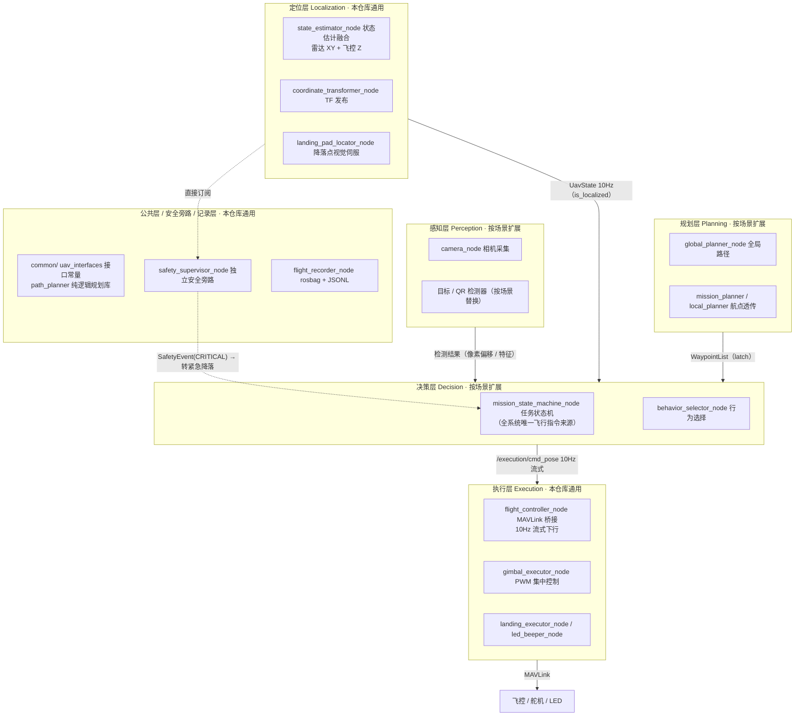

# 自主无人机五层解耦架构（Autonomous Drone Five-Layer Architecture）

> 一套经过多届全国级竞赛**实飞验证**的无人机/机器人自主系统 ROS 框架。
> 系统按「感知 → 定位 → 规划 → 决策 → 执行」五层严格解耦，外加公共层、安全旁路与记录层；
> 换任务场景只改业务层，执行/定位/安全/记录全部复用。

**本仓库是框架的通用骨架**：公共层 + 执行层 + 定位层 + 安全旁路 + 记录层 + 全部自定义接口（12 msg / 5 srv / 1 action），开箱即可驱动真实飞控；业务层（感知/规划/决策）的扩展方法见 [适配新场景](#适配新场景)。

---

## 目录

- [框架亮点](#框架亮点)
- [架构总览](#架构总览)
- [各层职责与换场景改动量](#各层职责与换场景改动量)
- [核心设计决策](#核心设计决策)
- [快速开始](#快速开始)
- [仓库结构](#仓库结构)
- [演进史与实飞验证](#演进史与实飞验证)
- [文档导航](#文档导航)
- [适配新场景](#适配新场景)
- [开源协议与致谢](#开源协议与致谢)

---

## 框架亮点

| 特性 | 实现方式 | 解决的问题 |
|------|---------|-----------|
| **抗 MAVLink 丢包** | 10Hz Timer 持续流式发送位姿命令（而非"发一次等到达"） | 根治远距离断连：丢一帧无所谓，100ms 后下一帧就到 |
| **ROS 事件循环永不阻塞** | 状态机由 Timer 驱动，禁止在回调中 `sleep()` | 根治回调阻塞导致心跳丢失、飞控断连 |
| **双层安全监控** | 决策层内 `safety_monitor` + 独立进程 `safety_supervisor` 直接旁路订阅定位层 | 状态机卡死时安全监控仍然存活，CRITICAL 事件触发紧急降落 |
| **飞行指令单一出口** | 全系统只有任务状态机能发飞行指令，其余节点只发布检测/航点/事件 | 杜绝多源控制冲突，安全边界清晰 |
| **感知-定位-决策解耦** | 感知只输出像素偏移量，由决策层按图像时间戳对齐定位历史后换算世界坐标 | 感知层可脱离无人机独立测试 |
| **PWM 集中管理** | 所有舵机/激光经 `/pwm_ctrl` 由单一执行节点下发 | 避免多节点并发写 PWM 冲突 |
| **接口集中管理** | 全部 Topic/Service/Action 名、状态枚举、场地常量集中在 `common/uav_interfaces.py` | 消灭魔法字符串，换场景改一处生效 |
| **赛后可复盘** | rosbag + JSONL 双格式飞行记录 | 离线回放分析每一帧决策依据 |

**实机平台参考**：Orange Pi 5 Pro（ROS Noetic）+ ZMO-M4 飞控（MAVLink）+ FAST-LIO 激光定位 + 下视相机。任何 MAVLink 兼容飞控（Pixhawk 等）均可替换使用。

---

## 架构总览



> 完整的参考实现状态机图、消息流图、状态流转表见 [docs/architecture.md](docs/architecture.md) 与 [docs/框架设计文档.md](docs/框架设计文档.md)。

---

## 各层职责与换场景改动量

| 层级 | 职责 | 🚫 层间禁令 | 换场景 |
|------|------|------------|:------:|
| 感知层 | 传感器接入、目标检测、特征提取 | 不得控制硬件、不得发指令 | **必改** |
| 定位层 | 位姿估计融合、坐标变换、降落视觉伺服 | 不得订阅决策层状态 | 🟢 复用 |
| 规划层 | 全局/局部路径生成、航点序列 | 不得直接调飞控 | **必改** |
| 决策层 | 状态机、任务调度、异常恢复、行为选择 | 不得处理原始图像 | **必改** |
| 执行层 | MAVLink 桥接、PWM 驱动、降落执行、蜂鸣器 | 不得做决策/规划 | 🟢 复用 |
| 公共层 | 接口名、状态枚举、场地常量、纯逻辑规划库 | — | 🟡 只改常量 |
| 安全旁路 | 独立监控越界/低电压/遥控丢失/定位丢失 | 不直接控制飞控 | 🟡 只调参数 |
| 记录层 | rosbag + JSONL 全链路记录 | — | 🟢 复用 |

---

## 核心设计决策

**1. 为什么 10Hz 流式发送 MAVLink 位置命令？**
旧框架"发一次就等到达"，丢包即永久等待 → 断连。改为 10Hz Timer 持续发送 `SET_POSITION_TARGET`：飞控每 100ms 收到一帧，单帧丢失无影响。这是框架最核心的设计决策，根治了历史版本 30-40 格断连问题。

**2. 为什么状态机用 Timer 驱动而非回调驱动？**
旧框架在回调中 `rospy.sleep()` 阻塞 ROS spin，MAVLink 心跳无法及时处理 → 飞控断连。Timer 每 100ms 执行一次 tick，事件循环始终畅通。

**3. 为什么安全监控要做成两层？**
决策层内的 `safety_monitor` 依赖任务状态，状态机卡死则它随之失效；`safety_supervisor` 是独立进程，直接订阅定位层 `/localization/uav_state`，发布 `SafetyEvent(CRITICAL)`，由状态机响应转紧急降落。监控者与被监控者彻底隔离。

**4. 为什么感知层只输出像素偏移量？**
感知节点不持有无人机位置。偏移量（按高度与焦距换算）交给决策层，由其按图像时间戳对齐定位历史后换算绝对世界坐标——感知层与定位层完全解耦，感知可独立测试。

**5. 为什么起飞用 Action 而不是 Service？**
起飞是长时间任务，需要进度反馈与可抢占取消。Action 天然支持 `feedback` 与 `cancel`。

更多设计问答见 [docs/使用说明.md](docs/使用说明.md) 「框架设计规范速查 10 问」。

---

## 快速开始

### 环境依赖

- Ubuntu 20.04 + ROS Noetic（Python 3.8）
- pip 依赖：`pymavlink`（飞控通信）、`pyserial`、`opencv-python`、`numpy`

```bash
pip3 install pymavlink pyserial opencv-python numpy
```

### 编译

```bash
# 方式一：把本仓库 src/uav_mavlink_pkg 放入你的 catkin 工作空间
cd ~/uav_ws/src    # 若无: mkdir -p ~/uav_ws/src
# 将 src/uav_mavlink_pkg 放入该目录后：
cd ~/uav_ws
catkin_make -DCATKIN_WHITELIST_PACKAGES="uav_mavlink_pkg"
source devel/setup.bash

# 方式二：直接 clone 进工作空间（目录名任意，catkin 按 package.xml 识别）
cd ~/uav_ws/src
git clone <本仓库地址> uav_mavlink_pkg
cd .. && catkin_make && source devel/setup.bash
```

编译成功后 12 个自定义消息 / 5 个服务 / 1 个动作自动生成。

### 最小骨架启动（无需写任何业务代码）

```bash
roslaunch uav_mavlink_pkg skeleton_minimal.launch fc_serial_port:=/dev/ttyXXX
```

该命令启动 **执行层（MAVLink 桥接）+ 定位层（状态估计 / TF）+ 安全旁路 + 记录层** 共 5 个通用节点，即可验证框架核心链路。串口按实际设备修改。

### 验证数据流

```bash
rostopic hz /execution/cmd_pose           # 执行层位姿指令, 应接近 10Hz
rostopic echo /localization/uav_state     # 定位融合输出（含 is_localized）
rostopic echo /safety/event               # 安全事件（异常时优先看这里）
rosrun tf view_frames                     # 查看 world → base_link → camera TF 树
rqt_graph                                 # 查看节点拓扑
```

参数说明见 [`src/uav_mavlink_pkg/config/skeleton_params.yaml`](src/uav_mavlink_pkg/config/skeleton_params.yaml)（顶层 key = 节点名，自动映射到节点私有参数 `~xxx`）。

---

## 仓库结构

```
autonomous-drone-five-layer-architecture/
├── README.md                          # 本文件
├── CHANGELOG.md                       # 框架演进记录（五届赛事迭代）
├── docs/
│   ├── architecture.md                # mermaid 架构图 / 状态机图 / 消息流图
│   ├── 框架设计文档.md                 # 架构与数据流详解、状态机设计、接口清单、适配指南
│   └── 使用说明.md                    # 层职责边界、设计规范 10 问、话题速查、调试命令
└── src/uav_mavlink_pkg/
    ├── package.xml / CMakeLists.txt
    ├── msg/                           # 12 个自定义消息（UavState、Waypoint、SafetyEvent…）
    ├── srv/                           # 5 个自定义服务（GetUavState、PlanRoute…）
    ├── action/                        # Takeoff.action（带进度反馈的长任务）
    ├── scripts/
    │   ├── common/                    # 公共层: uav_interfaces.py 接口常量 + path_planner.py 纯逻辑规划库
    │   ├── execution/                 # 执行层: 飞控桥接 / PWM 舵机 / 降落执行 / 蜂鸣器
    │   ├── localization/              # 定位层: 状态估计融合 / TF / 降落点视觉伺服
    │   ├── safety/                    # 安全旁路: 独立进程监控（CRITICAL 事件）
    │   └── logging/                   # 记录层: rosbag + JSONL
    ├── launch/
    │   └── skeleton_minimal.launch    # 最小骨架启动
    └── config/
        └── skeleton_params.yaml       # 骨架通用参数（按场景复制修改）
```

> **关于业务层代码**：感知 / 规划 / 决策层的业务节点（状态机、检测器等）依赖具体任务场景，未随本骨架发布；其设计规范、状态机参考实现与适配流程完整记录在 `docs/` 两份文档中。`docs/框架设计文档.md` §10 给出逐文件的最小改动清单。

---

## 演进史与实飞验证

框架不是一次性设计，而是在五届全国级竞赛中**实飞迭代**沉淀而来——每一届都在上一届的代码上演进，最终收敛为五层解耦架构：

| 阶段 | 场景 | 代码形态 | 关键演进 | 规模（.py / 行 / 自定义接口） |
|------|------|---------|---------|:---:|
| 第 28 届 CRAIC 国赛 | 无人机竞赛任务 | 脚本式：`demo.py` + 巨石库 `uav_library.py` | 首次完整实飞，暴露脚本堆叠难维护问题 | 10 / ~3800 / 0 |
| 2025 H 题 · 野生动物巡查 | 巡查任务 | 脚本式延续 | 拆出地面站通信 `gs_comm`、路径规划 `path_planner` 独立模块 | 15 / ~3300 / 0 |
| 2024 D 题 · 立体货架盘点 | 货架盘点 | ⭐ **五层解耦成型** | 整体重构：平铺脚本拆为八模块分层结构，接口契约化 | 23 / ~5450 / 11 msg |
| 2023 G 题 · 空地协同智能消防 | 空地协同 | 五层演进 | 车机协同通信、火源检测、全覆盖巡逻 | 26 / ~4900 / 9 msg + 5 srv |
| 2026 D 题 · 搜救飞行器（本科） | 搜救任务 | **五层完善版** | 10Hz 流式 MAVLink、Timer 状态机、QR 解码、A* 引导、三色投放、视觉伺服降落 | 29 / ~6800 / 12 msg + 5 srv + 1 action |

### 架构进化：从脚本堆叠到五层解耦

**脚本式时代**（28 届 CRAIC / 2025 H）——所有逻辑平铺在 `scripts/` 根目录，模型权重与代码混放：

```
scripts/
├── demo.py            # 主流程：起飞→巡逻→识别→投放→降落 全在一个文件
├── uav_library.py     # 864 行"全能库"：飞控/PWM/蜂鸣器/图像/定位/遥控什么都管
├── img_process.py     # 视觉处理
├── gs_comm.py         # (2025H) 地面站通信
├── path_planner.py    # (2025H) 路径规划
└── *.pth / *.h5       # 模型权重混在代码目录
```

**五层时代**（2024 D 起成型，2026 D 完善）——目录即架构，层级即边界：

```
scripts/
├── common/        # 公共层：接口常量 + 纯逻辑规划库
├── perception/    # 感知层
├── localization/  # 定位层
├── planning/      # 规划层
├── decision/      # 决策层
├── execution/     # 执行层
├── safety/        # 安全旁路
└── logging/       # 记录层
```

### 一堂重构课：864 行全能库的去向

28 届的 `uav_library.py` 是理解本框架演进的最佳样本——一个 `uav_lib` 类同时承担六种职责，重构后各自归入五层：

| 当年的职责（28 届 `uav_lib` 类） | 如今的归属（2026 D 完善版） |
|------|------|
| `uav_takeoff` / `set_FlightMode` / `uav_land` 飞控控制 | 执行层 `flight_controller_node`（MAVLink 桥接）+ `landing_executor_node` |
| `set_pwm_out` / `set_beep_open` 舵机与蜂鸣器 | 执行层 `gimbal_executor_node` + `led_beeper_node`（PWM 集中管理） |
| `get_img*` 图像获取 | 感知层 `camera_node` + 检测器节点 |
| `_wait_position` / `Position_calibration` 定位等待与标定 | 定位层 `state_estimator_node` + `coordinate_transformer_node` |
| `fit_circle_*` / 圆心拟合算法 | 感知/定位层圆心检测节点（如 `landing_pad_locator_node` 的 Hough 圆检测） |
| `get_rc_data` / `P_log` 遥控数据与日志 | 执行层话题发布 + 记录层 `flight_recorder_node` |

**进化的本质**：不是推倒重写，而是职责归位——2025 H 仓库至今保留着 28 届代码备份（`legacy/`），见证逐届继承；2024 D 起每届只重写"必改层"，执行/定位/安全/记录持续复用至今。

**实飞验证记录**：

- 各届赛事任务均完成**全流程实飞**（起飞 → 自主任务 → 引导/返航 → 降落），非仿真阶段成果；
- 2026 D 题搜救：完成 QR 出口解码 → 蛇形搜索 → 视觉识别投放 → A* 引导 → 黑圆停机坪视觉伺服降落的完整闭环实飞；
- 迭代中根治的实飞问题（MAVLink 断连、回调阻塞、PWM 冲突）均已转化为本框架的结构性设计（见[核心设计决策](#核心设计决策)）。

---

## 文档导航

| 文档 | 内容 |
|------|------|
| [docs/architecture.md](docs/architecture.md) | mermaid 图集：五层架构、任务状态机、核心消息流 |
| [docs/框架设计文档.md](docs/框架设计文档.md) | 权威设计文档：各层文件职责、状态机逐状态设计、ROS 接口清单、坐标系规范、**§10 新场景适配指南** |
| [docs/使用说明.md](docs/使用说明.md) | 上手手册：编译启动、层间禁令、设计规范 10 问、通用话题速查、调试命令、常见问题 |

---

## 适配新场景

以「新任务场景」为例的最小改动路径（详见 [docs/框架设计文档.md](docs/框架设计文档.md) §10）：

```
第 1 步  common/path_planner.py            → 新的全覆盖/搜索路径算法
第 2 步  common/uav_interfaces.py          → 场地常量 + 新任务状态枚举 + 航点语义
第 3 步  decision/mission_state_machine    → 新任务状态机（唯一飞行指令出口）
第 4 步  perception/xxx_detector_node      → 新目标检测节点（输出偏移量即可）
第 5 步  config/场景.yaml + launch/场景.launch → 新参数与节点编排
```

**无需改动**：执行层全部（MAVLink 桥接 / PWM / 降落 / 蜂鸣器）、定位层全部、安全旁路、记录层——这些已在本仓库中，直接复用。

---

## 开源协议与致谢

本项目基于 [MIT License](LICENSE) 开源。

框架迭代受益于开源社区：

- [pymavlink](https://github.com/ArduPilot/pymavlink) — MAVLink 协议通信
- [FAST-LIO](https://github.com/hku-mars/FAST_LIO) — 激光惯性里程计（定位层输入源）
- ROS / catkin 社区

框架由多届竞赛队员共同实飞迭代而成，感谢每一届并肩调试到深夜的队友。

---

*参考实现平台：Orange Pi 5 Pro + ROS Noetic + ZMO-M4 飞控（MAVLink）+ FAST-LIO + 下视相机。欢迎 Issue / PR。*
