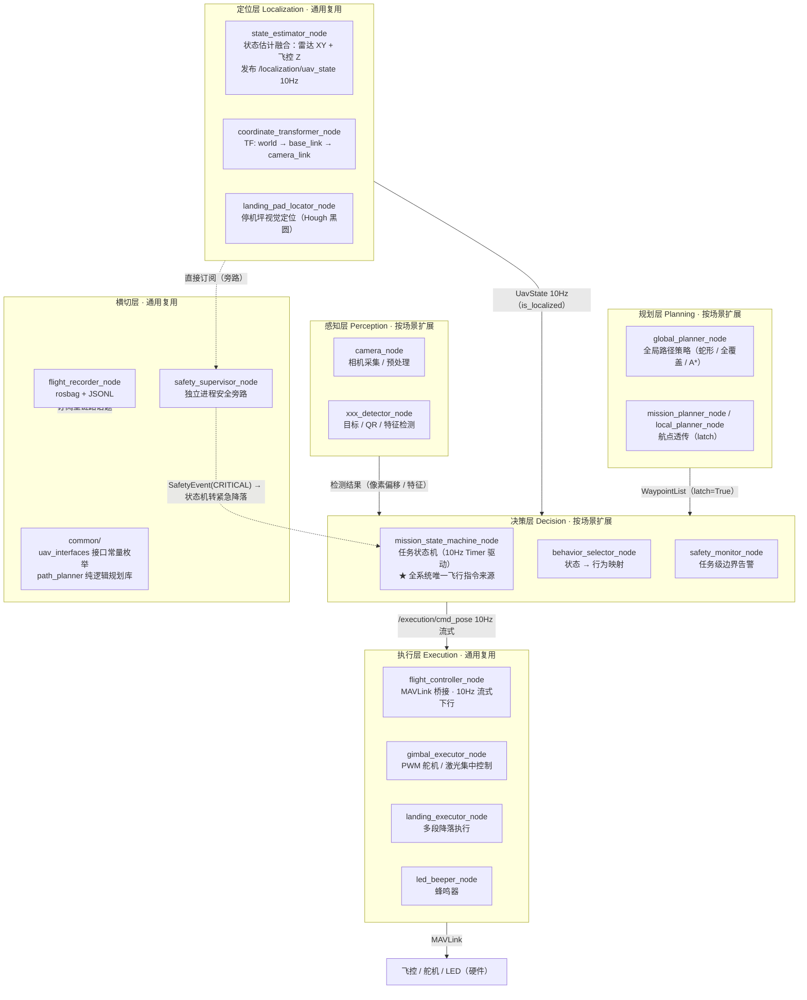
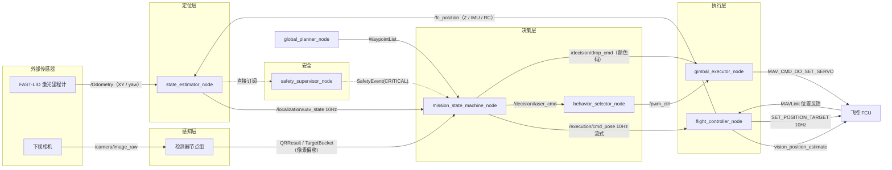
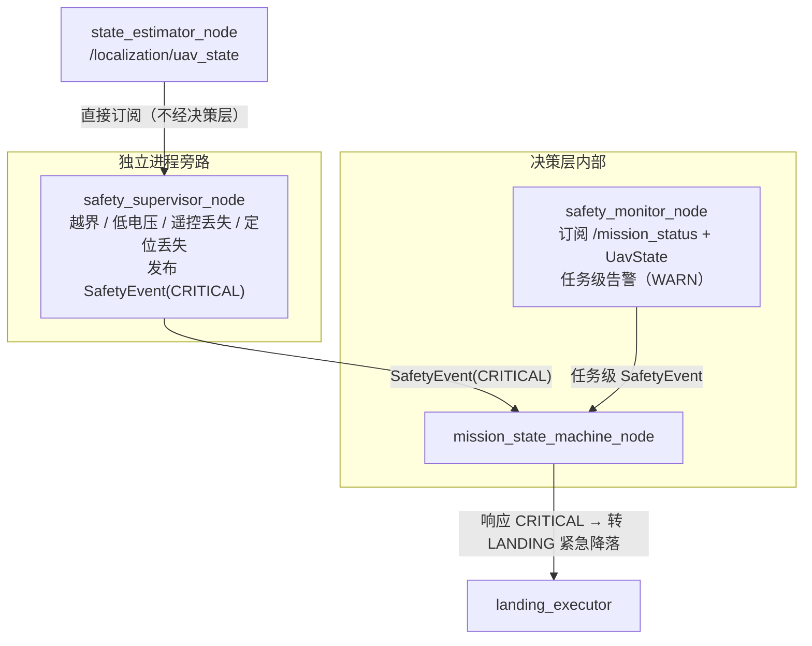
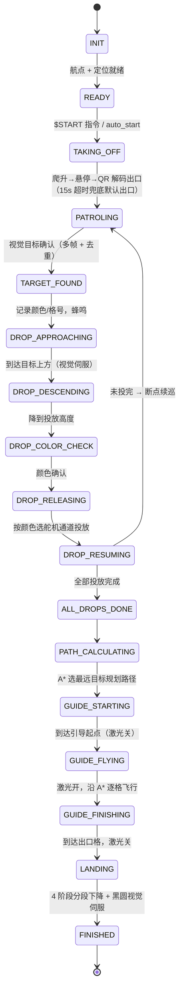

# 架构图集（Architecture Diagrams）

> 本文档用 mermaid 描述五层解耦框架的架构、消息流与任务状态机。
> 状态机为 2026 搜救场景参考实现的流转设计，作为编写新任务状态机的模板。
> 完整设计说明见 [框架设计文档.md](框架设计文档.md)。

---

## 1. 五层解耦架构



**关键约束**：层间只经 ROS Topic/Service 通信；只有决策层能发飞行指令；感知层永不直接控制硬件。

---

## 2. 核心消息流（数据链路）



**10Hz 流式抗丢包**：`SET_POSITION_TARGET` 以 10Hz 持续发送，单帧丢失由 100ms 后的下一帧补偿——这是对旧框架「发一次等到达」断连问题的根治方案。

---

## 3. 安全链路（双层监控）



设计要点：`safety_supervisor` 与被监控的状态机**互不依赖**——状态机卡死时旁路监控依然存活；旁路本身不直接控制飞控，紧急动作仍由状态机统一执行，控制权单一。若状态机彻底卡死，由遥控器拨杆接管（非 GUIDED 模式下状态机自动停发指令让出控制权）。

---

## 4. 任务状态机参考实现（2026 搜救场景）

> 业务层示例，展示状态机的粒度与转移设计。编写新场景状态机时以此为模板。



**防重复触发机制**：确认目标仅在 `PATROLING` 阶段进入投放流程；已投目标按格号 ±1 去重；恢复巡逻时重置航点计时，避免当前格被"超时跳过"。

---

## 5. 坐标系与场地规范（参考实现）

```
巡逻区域: 50dm × 40dm，网格 10列 × 8行（X0~X9 × Y0~Y7），每格 5dm × 5dm
原点: (X0, Y0) 格中心 = (0, 0) dm；起飞点 = 场地左下角
机头朝向: X+；机体左侧: Y+
飞行高度: 巡逻/引导统一 1.0m；投放 0.5m
内部单位: 路径规划用 dm，ROS 消息与地面站协议用 m（×0.1 换算）
```

---

*图集基于框架设计文档 v2.1 绘制，2026-08-30。*
